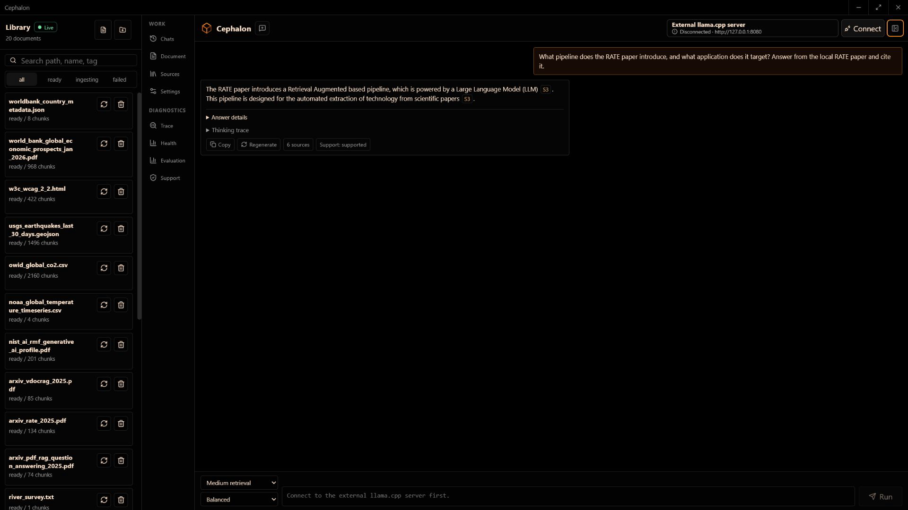
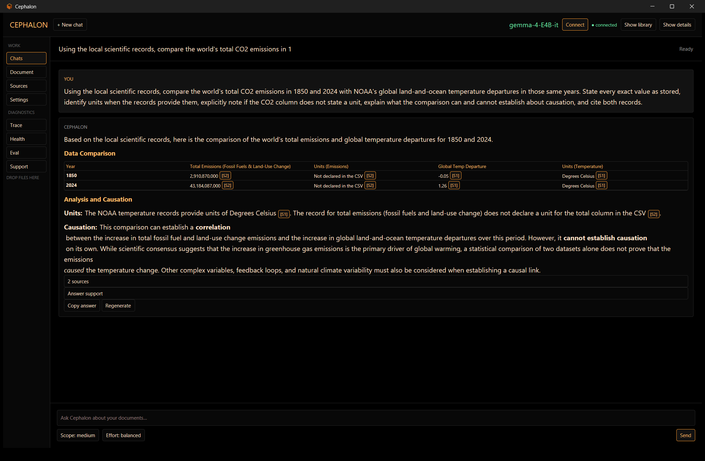

# Cephalon

Cephalon is a local-first desktop workbench for asking grounded questions about your own documents. Import a library, connect the local chat model you already use, and get answers with stable citations such as `[[src:S1]]`.

It is designed for private research, technical documentation, notes, PDFs, and specialised collections where knowing *which source supports an answer* matters as much as the answer itself. Your documents, metadata, chat history, and retrieval index stay on your computer.

Cephalon is particularly useful with models fine-tuned for specialised knowledge domains, tasks, writing styles, programming conventions, academic subjects, specialised knowledge base, or creative work.

I built this originally for running LLM inference on a large corpus of scientific and technical papers. I improved the architecture by incorporating the best RAG techniques I found:

- Hybrid retrieval with independent signals
- True full-set listwise reranking
- Citation accounting and fail-safe behavior
- Exact evidence and provenance
- RATE-style validation
- High document fidelity: PDF ingestion preserves page, layout, tables, captions, bounding boxes, and asset provenance.
- Auditable retrieval

` `



` ` 



## What it does

- Imports common office, text, data, and PDF files into a searchable local library.
- Preserves useful PDF provenance, including pages, layout, tables, captions, and bounding boxes when available.
- Combines semantic and keyword search, then shows sources and retrieval diagnostics alongside answers.
- Validates evidence and claim coverage before presenting citations.
- Keeps chat generation separate from document retrieval, so you stay in control of the chat GGUF and llama.cpp server.
- Provides a focused desktop workflow: library, chat, sources, trace, health, evaluations, settings, and local model management.

## The retrieval stack

Cephalon intentionally uses one local retrieval stack:

| Role | Model | Runtime |
| --- | --- | --- |
| Embedder | Jina Embeddings v5 Nano Retrieval `Q8_0` | dedicated llama.cpp embeddings server, normalized 768-dimensional vectors |
| Reranker | Jina Reranker v3.5 | isolated Transformers worker using its official custom-code interface |

Dense LanceDB retrieval and SQLite FTS5 keyword retrieval stay independent, are fused with reciprocal-rank fusion, and the full fused candidate set is listwise reranked when the reranker is available. If the reranker is unavailable, Cephalon continues in clearly marked degraded mode; if the embedder is unavailable, retrieval is safely disabled.

## Jina AI models

Cephalon uses Jina AI's [Jina Embeddings v5 Nano Retrieval](https://huggingface.co/jinaai/jina-embeddings-v5-text-nano-retrieval-GGUF) and [Jina Reranker v3.5](https://huggingface.co/jinaai/jina-reranker-v3.5). Thank you to Jina AI for making these retrieval models available.

Both models are licensed under [CC BY-NC 4.0](https://creativecommons.org/licenses/by-nc/4.0/); use of the model files is subject to that license.

## Quick start

Cephalon supports Windows and Linux. The commands below use Windows PowerShell; see [LOCAL_STARTUP_NOTES.md](LOCAL_STARTUP_NOTES.md) for Linux and detailed setup notes.

1. Install Node.js, Python 3.14, and a recent llama.cpp build with `llama-server`.

2. Install Cephalon dependencies:

   ```powershell
   py -3.14 scripts\setup_python.py
   npm.cmd install
   ```

3. Start the chat server with the GGUF you want to use. Cephalon does not choose or load this model for you:

   ```powershell
   & "C:\AI\llama.cpp\build\bin\Release\llama-server.exe" `
     -m "C:\AI\models\your-chat-model.gguf" `
     --device Vulkan0 --gpu-layers 999 `
     --ctx-size 8192 --host 127.0.0.1 --port 8080 --no-webui
   ```

4. Start the desktop app:

   ```powershell
   npm.cmd run tauri dev
   ```

5. In **Settings → Fixed retrieval stack**, download the embedder and reranker. Restart Cephalon, then run **Reindex all documents**.

6. Press **Connect** for the chat server, import a few documents, and ask a question. Open **Sources** or **Trace** whenever you want to inspect the supporting evidence.

## Everyday use

For the best results:

1. Import the documents that should be treated as your reference set.
2. Reindex after installing the retrieval models or after intentionally changing the document collection.
3. Ask focused questions and request citations when the wording must be auditable.
4. Use the source drawer to jump from an answer to the exact document chunk and provenance.
5. Treat a weak-support indicator as a prompt to refine the question or inspect the evidence rather than as a confident answer.

Saved chats are local searchable memory, not model training data.

## How the local services fit together

```text
Your chat GGUF ── llama-server :8080 ──> answer generation
                                                ▲
Documents ──> Nano embedder :8090 ──> LanceDB ─┼──> Cephalon desktop app
                  GPU by default               │
FTS5 keyword search ───────────────────────────┤
Jina Reranker v3.5 worker ─────────────────────┘
```

The chat and embedding servers must remain separate. On Windows, Cephalon automatically starts its managed Nano embedder with `Vulkan0` and full layer offload after the model is installed. If your llama.cpp device name differs, set `CEPHALON_EMBEDDER_DEVICE` and `CEPHALON_EMBEDDER_GPU_LAYERS` before launch.

## Local data and model files

By default, Cephalon uses `~/cephalon-data` (for example, `C:\Users\<you>\cephalon-data` on Windows). Retrieval models live under:

```text
~/cephalon-data/models/
  jina-v5-nano-retrieval-q8_0/
    v5-nano-retrieval-Q8_0.gguf
  jina-reranker-v3.5/
    config.json
    tokenizer.json
    ... official model files
```

Settings can download, verify, open, or remove either model cache. The Nano GGUF is checked against its fixed SHA-256; reranker verification checks the pinned Hugging Face revision manifest. Use `CEPHALON_DATA_DIR` or `CEPHALON_MODEL_DIR` to place this data elsewhere.

## Running and building

| Goal | Windows command |
| --- | --- |
| Desktop development | `npm.cmd run tauri dev` |
| Browser development | `npm.cmd run dev:full` |
| Backend only | `py -3.14 python\main.py` |
| Frontend build | `npm.cmd run build` |
| Desktop package | `npm.cmd run tauri build` |

The packaged app only includes Cephalon's backend.You need llama.cpp, a chat GGUF, and the retrieval model files (download the retrieval models from settings or by setting them up yourself).

## Useful configuration

Most users only need the default localhost ports. These are the settings worth changing when your machine uses different paths or ports:

```powershell
$env:CEPHALON_LLAMA_SERVER_BIN="C:\AI\llama.cpp\build\bin\Release\llama-server.exe"
$env:CEPHALON_LLAMA_SERVER_URL="http://127.0.0.1:8080"
$env:CEPHALON_LLAMA_SERVER_CONTEXT_TOKENS="8192"
$env:CEPHALON_EMBEDDER_DEVICE="Vulkan0"
$env:CEPHALON_EMBEDDER_GPU_LAYERS="999"
```

| Service | Default port |
| --- | --- |
| Cephalon backend | 8765 |
| Browser development server | 1420 |
| Chat llama.cpp server | 8080 |
| Nano embeddings server | 8090 |

For the full environment-variable list, manual embedding-server operation, release builds, and troubleshooting, use [LOCAL_STARTUP_NOTES.md](LOCAL_STARTUP_NOTES.md).

## Diagnostics and local API

Settings shows the active models, paths, health, process IDs, and reindex progress. The desktop diagnostics panels expose evidence, claims, retrieval candidates, and index health.

These local endpoints are also useful for scripts and troubleshooting:

| Endpoint | Purpose |
| --- | --- |
| `GET /models/status` | Installed models, integrity, runtime state, and reindex status |
| `GET /runtime/embedder/status` | Embedder process, port, health, and errors |
| `GET /runtime/reranker/status` | Reranker worker health and queue state |
| `POST /reindex/full` | Reindex the complete document library |
| `POST /reindex/stale` | Reindex only documents that need it |
| `GET /reindex/progress` | Current or last completed reindex totals |

## Validation

```powershell
py -3.14 -m pytest python\test_backend_stabilization.py python\test_rag_observability.py -q
npm.cmd run test:frontend
npm.cmd run build
cargo check --manifest-path src-tauri\Cargo.toml
```
