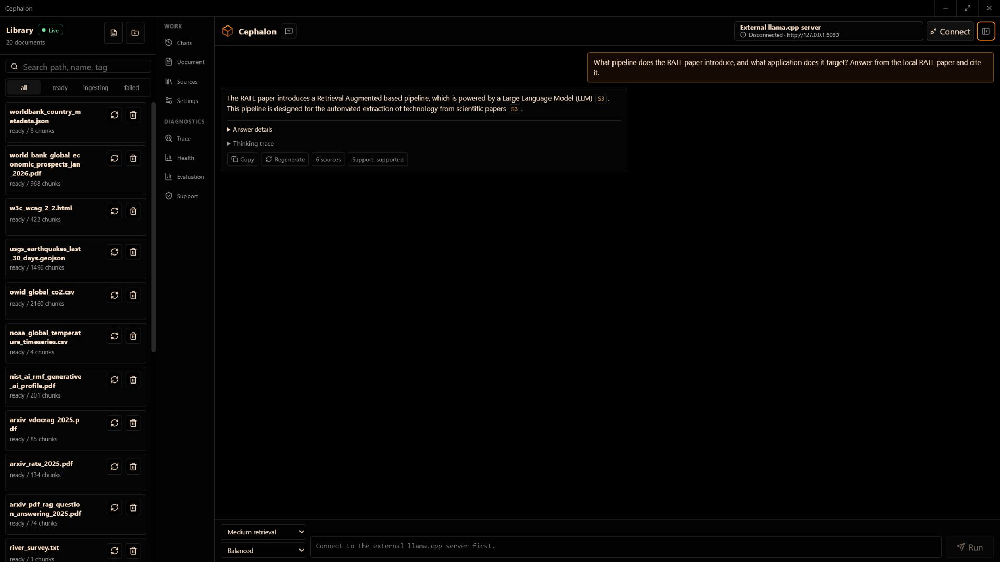
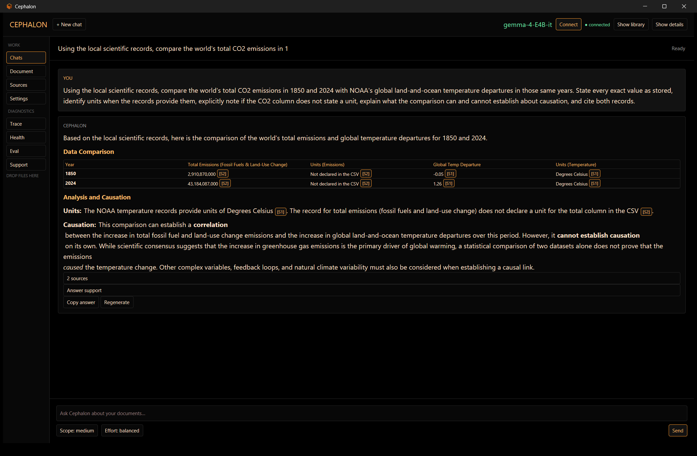

# Cephalon

Cephalon is a local-first desktop workbench for asking grounded questions about your own documents. Import a library, connect the local chat model you already use, and get answers with stable citations such as `[[src:S1]]`.

It is designed for private research, technical documentation, notes, PDFs, and specialised collections where source traceability matters.

Cephalon is particularly useful with models fine-tuned for specialised knowledge domains, tasks, writing styles, programming conventions, academic subjects, specialised knowledge bases, or creative work.

- **Local-first operation:** Files in the Library are local. You choose the chat model, which runs through an external llama.cpp server. Cephalon runs EmbeddingGemma 2 Text 270M and Jina Reranker v3.5 locally for document retrieval.

I built this originally for running LLM inference on a large corpus of scientific and technical papers. I improved the architecture by incorporating the following RAG techniques:

- **Hybrid retrieval:** Semantic search finds passages with similar meaning, while SQLite FTS5 finds exact terms. Cephalon keeps the result sets independent, combines their ranks, and preserves strong candidates from either path.
- **Full-set reranking:** Jina v3.5 scores the complete fused candidate set. Cephalon then selects the final context without discarding a useful passage too early.
- **Hierarchical context assembly:** Cephalon retrieves precise child chunks first, then adds bounded sibling or parent context when it improves completeness. The original child remains the citation anchor. Source: [HiChunk](https://arxiv.org/abs/2509.11552).
- **Layout-aware PDF evidence:** Text can be expanded to related headings, captions, tables, figures, and cross-page continuations. This avoids treating every block as unrelated. Based on: [LAD-RAG: Layout-Aware Dynamic RAG framework](https://arxiv.org/abs/2510.07233).
- **Coverage-aware evidence control:** Cephalon breaks a question into concrete evidence needs and selects sources that cover them. When Thorough mode is selected, it can run one targeted follow-up search for missing evidence. Source: [S2G-RAG](https://arxiv.org/abs/2604.23783).
- **Verified answers:** Cited claims are checked for missing support, contradictions, negation errors, and incorrect numbers or units. Thorough mode can audit the draft and repair it once. Source: [OpenScholar](https://arxiv.org/abs/2411.14199) and [RAGChecker](https://arxiv.org/abs/2408.08067).
- **Structured table reasoning:** PDF, CSV, and XLSX tables retain row, column, cell, and location data. Cephalon can run bounded lookups, filters, comparisons, and arithmetic, then cite and recheck the exact cells used. Source: [T-RAG](https://arxiv.org/abs/2203.16714) and [T²-RAGBench](https://arxiv.org/abs/2506.12071).
- **Exact provenance and retrieval traces:** Citations point to stable source chunks with page, layout, bounding-box, table-cell, and asset details when available. The Sources and Trace views show what was retrieved, reranked, selected, and verified.





## What it does

- Imports common office, text, data, and PDF files into a searchable local library.
- Preserves useful PDF provenance, including pages, layout, tables, captions, and bounding boxes when available.
- Combines semantic and keyword search, then shows sources and retrieval diagnostics alongside answers.
- Validates evidence and claim coverage before presenting citations.
- Keeps chat generation separate from document retrieval, so you stay in control of the chat GGUF and llama.cpp server.
- Provides a focused desktop workflow: library, chat, sources, trace, health, evaluations, settings, and local model management.

## The retrieval stack

Cephalon uses one local retrieval stack:

| Role | Model | Runtime |
| --- | --- | --- |
| Embedder | EmbeddingGemma 2 Text 270M Q8_0 | managed llama.cpp Vulkan server, mean pooling, L2-normalized 768-dimensional vectors |
| Reranker | Jina Reranker v3.5 | Q8_0 GGUF through pinned llama.cpp PR #26286, Vulkan, listwise cosine scores |

Dense LanceDB and SQLite FTS5 results remain independent and are fused with reciprocal-rank fusion. When the reranker is available, the full fused candidate set is reranked listwise. If the reranker is unavailable, Cephalon continues in clearly marked degraded mode. If the embedder is unavailable, retrieval is safely disabled.

## Retrieval model provenance

EmbeddingGemma 2 uses the pinned text-only Q8_0 [Unsloth GGUF conversion](https://huggingface.co/unsloth/embeddinggemma-2-GGUF) of [Google's model](https://huggingface.co/google/embeddinggemma-2); Jina v3.5 uses a pinned [official Safetensors snapshot](https://huggingface.co/Jina v3.5-Embedding/Jina v3.5-Reranker-V1-Nano-R2). Install manifests record immutable revisions and hashes. Queries use `task: search result | query: ` and indexed passages use `title: none | text: `. No vision/audio projector is installed.

Review each model repository's license before distributing its files.

## Quick start

The desktop app supports Windows and Linux. Q8 embedding inference has been smoke-checked on Windows with an RX 6700 XT; performance and retrieval quality have not been benchmarked for this runtime. The commands use PowerShell. See [retrieval operations](docs/rag/operations.md) for the current model setup.

1. Install Rust, Python 3.14, and a recent llama.cpp build with `llama-server`.

2. Install Cephalon dependencies:

   ```powershell
   py -3.14 scripts\setup_python.py
   ```

3. Start the chat server with the GGUF you want to use. Cephalon does not choose or load this model for you:

   ```powershell
   & "C:\AI\llama.cpp\build\bin\Release\llama-server.exe" `
     -m "C:\AI\models\your-chat-model.gguf" `
     --device Vulkan0 --gpu-layers 999 `
     --ctx-size 8192 --host 127.0.0.1 --port 8080 --no-webui
   ```

4. Start the desktop app:

   ```powershell
   cargo run
   ```

5. Follow [retrieval setup](docs/rag/operations.md) to install the pinned EmbeddingGemma 2 Q8_0 GGUF, its separate llama.cpp b11456 Vulkan runtime, and Jina v3.5's Q8 artifacts, isolated NumPy/tokenizers environment, and PR #26286 Vulkan runtime. Restart Cephalon, then run **Reindex all documents**.

6. Press **Connect** for the chat server, import a few documents, and ask a question. Open **Sources** or **Trace** whenever you want to inspect the supporting evidence.

## Everyday use

For the best results:

1. Import the documents that should be treated as your reference set.
2. Reindex after installing or changing the retrieval models, or after changing the chunking configuration or document collection.
3. Ask focused questions when source precision matters. Request citations when the wording must be auditable.
4. Use **Sources** or the source drawer to jump from an answer to the exact document chunk and provenance. Open **Trace** to examine the retrieval process.
5. Treat weak or unsupported results as a prompt to refine the question or inspect the retrieved evidence rather than as a confident answer.

Saved conversations remain on your computer and are used only as searchable chat history and optional conversation context, not as model training data.

## Runtime separation

Cephalon manages the fixed embedding and reranking processes after explicit setup. Chat generation remains user-controlled and runs through an external llama.cpp server, so you can choose any compatible GGUF without changing the retrieval index or coupling the chat server to the retrieval stack.

Chat generation uses the external llama.cpp server. Embeddings run in a separate managed llama.cpp process; reranking uses Jina v3.5's isolated NumPy/tokenizers worker and GGUF helper. The embedder needs no Transformers or PyTorch environment. Cephalon starts the embedding server after explicit model and runtime setup.

The embedding server defaults to Vulkan GPU offload. To select CPU inference:

```powershell
$env:CEPHALON_EMBEDDER_GPU_LAYERS="0"
$env:CEPHALON_EMBEDDER_DEVICE="none"
```

## Local files and configuration

Cephalon stores its database, retrieval index, extracted document assets, and model files under `~/cephalon-data` by default. On Windows, this normally resolves to:

```text
C:\Users\<you>\cephalon-data
```

The retrieval models are stored under:

```text
~/cephalon-data/models/
  embeddinggemma-2-text-270m-q8_0/
    embeddinggemma-2-Q8_0.gguf
    cephalon-model-manifest.json
  jina-reranker-v3.5-gguf-q8_0/
    jina-reranker-v3.5-Q8_0.gguf
    projector.safetensors
    tokenizer.json
    cephalon-jina-worker.py
    cephalon-model-manifest.json
    ...
```

The Settings page can verify, open, and remove these model installations. Model acquisition is an explicit setup step; the application never downloads weights at runtime. Both model snapshots are checked against their pinned manifests.

Common configuration overrides:

| Variable                               | Purpose                                         | Default                   |
| -------------------------------------- | ----------------------------------------------- | ------------------------- |
| `CEPHALON_DATA_DIR`                    | Database, indexes, assets, and application data | `~/cephalon-data`         |
| `CEPHALON_MODEL_DIR`                   | Retrieval-model directory                       | `<data directory>/models` |
| `CEPHALON_LLAMA_SERVER_URL`            | Chat-generation server                          | `http://127.0.0.1:8080`   |
| `CEPHALON_LLAMA_SERVER_CONTEXT_TOKENS` | Chat model context limit override               | Detected when available   |
| `CEPHALON_EMBEDDER_DEVICE`             | llama.cpp device selection, e.g. `Vulkan0`     | Auto-selected GPU         |
| `CEPHALON_EMBEDDER_GPU_LAYERS`         | Embedding layers offloaded to GPU; 0 for CPU  | `99`                      |
| `CEPHALON_EMBEDDER_LLAMA_SERVER_BIN`   | Dedicated pinned embedding server executable  | data/runtimes/llama-b11456-vulkan/llama-server |
| `CEPHALON_RERANKER_PYTHON_BIN`         | Isolated Jina NumPy/tokenizers executable       | `runtimes/jina35-python`         |
| `CEPHALON_RERANKER_LLAMA_EMBEDDING_BIN` | Pinned PR #26286 Vulkan helper | Versioned Jina runtime |
| `CEPHALON_RERANKER_DEVICE` | Vulkan device for Jina | `Vulkan0` |
| `CEPHALON_RERANKER_GPU_LAYERS` | Jina GPU offload layers | `99` |
| `CEPHALON_RERANKER_MAX_CONTEXT_TOKENS` | Maximum listwise prompt tokens | `32768` |

Set environment variables before launching Cephalon. For example:

```powershell
$env:CEPHALON_EMBEDDER_DEVICE="Vulkan0"
cargo run
```

### Default ports

| Service                    | Port |
| -------------------------- | ---: |
| Cephalon local API         | 8765 |
| Chat llama.cpp server      | 8080 |
| Managed embedding server   | 8090 |
| Managed Jina v3.5 worker        | 8091 |

See [retrieval operations](docs/rag/operations.md) for current embedding settings and troubleshooting. [LOCAL_STARTUP_NOTES.md](LOCAL_STARTUP_NOTES.md) contains historical startup notes.

## Development and packaging

The desktop shell is a native Rust application built with GPUI Kit. Kit provides the native runtime, editable fields, controls, dialogs, notifications, and forms. Cephalon supplies the research workspace, citation-aware chat, and Graphite theme.

See [native-frontend.md](docs/native-frontend.md) for the dependency and packaging boundary.

| Task                                    | Windows command                                    |
| --------------------------------------- | -------------------------------------------------- |
| Run the native desktop application      | `cargo run`                                         |
| Run only the Python backend             | `py -3.14 python\main.py`                          |
| Check the native GPUI Kit application   | `cargo check`                                       |
| Build the native release                | `cargo build --release`                             |
| Build the packaged desktop directory    | `py -3.14 scripts\build_release.py`                |

The packaged application includes Cephalon’s Python backend. It does not include llama.cpp, a chat GGUF, the retrieval-model weights, or Jina v3.5's isolated Python environment. Install those with the explicit setup procedure before using retrieval.

## Diagnostics and local API

The Settings page reports model installation state, integrity checks, runtime health, process IDs, active paths, and reindex progress. Diagnostic views expose retrieval evidence, claim validation, candidate rankings, latency measurements, and index-health information.

The local API can be used for scripting and troubleshooting:

| Endpoint                          | Purpose                                                     |
| --------------------------------- | ----------------------------------------------------------- |
| `GET /health`                     | Overall backend and retrieval-stack health                  |
| `GET /models/status`              | Installed models, integrity state, and reindex requirements |
| `GET /runtime/embedder/status`    | Embedding-server process and health                         |
| `GET /runtime/reranker/status`    | Reranker worker and queue health                            |
| `POST /reindex/full`              | Reindex the complete document library                       |
| `POST /reindex/stale`             | Reindex only documents whose indexes are stale              |
| `GET /reindex/progress`           | Current or most recently completed reindex operation        |
| `GET /observability/index-health` | Document, chunk, index, and retrieval statistics            |
| `GET /retrieval/traces`           | Recently persisted retrieval traces                         |

All endpoints are local by default and are served from `http://127.0.0.1:8765`.

## Validation

Run the complete validation suite before packaging or submitting substantial changes:

```powershell
py -3.14 -m pytest python -q
cargo fmt --check
cargo check
cargo test
```

## License

Cephalon’s source code is available under the [MIT License](LICENSE). Retrieval-model files remain subject to their respective licenses described above.
