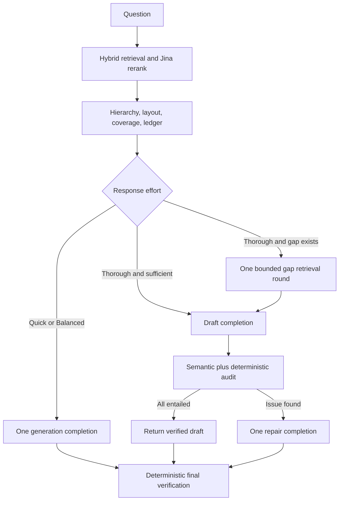

# RAG architecture

Cephalon indexes extractive parent summaries and child chunks in LanceDB while
retaining document structure in SQLite. A request follows this bounded path:

```text
question -> dense + FTS5 retrieval -> RRF -> Jina v3.5 rerank
         -> optional validated table plan + deterministic execution
         -> hierarchical context assembly -> compression -> generation
         -> citation and claim diagnostics
```



The Jina reranker is an external llama.cpp Vulkan service. Retrieval and
context assembly do not load a chat model; the selected chat model is required
only for answer generation and later model-assisted verification.

## Typed table index

Migration 018 adds normalized `tables`, `table_columns`, `table_rows`, and
`table_cells` records for PDF, CSV, and XLSX sources. Structured records and
their legacy table-text chunks are produced from the same extraction result and
replaced in one transaction. PDF cell boxes remain page-relative; CSV retains
dialect/encoding; XLSX retains worksheet references, merged ranges, formats,
and formulas without claiming recalculation. Stable content/location-derived
IDs make identical reingestion deterministic. See [structured-tables.md](structured-tables.md)
for the complete schema, limits, and rollback contract.

At request time, recognizable table questions may produce a validated
`TablePlan`. The executor reads only bound table IDs and numeric column indexes
through application-owned statements. Safe results join—not replace—the hybrid
context, then participate in compression and the evidence ledger. Any planning,
schema, unit, ambiguity, bound, or timeout failure returns to text retrieval.
The router makes no model call and a Thorough gap round can only re-enter the
same bounded route; it cannot bypass validation or recurse.

## Hierarchical context assembly

`services/context_assembly.py` converts reranked child hits into non-overlapping
context units. A unit always retains a retrieved child as its citation anchor.
It may contain:

- `child`: the exact retrieved result.
- `sibling_span`: at most five contiguous children, including at most one
  coherence neighbour on each side.
- `parent`: the complete parent when at least two independently retrieved
  children cover 40% of its child-token mass.

Parent and span text must fit `parent_max_tokens` and the request-level budget.
The request budget is capped at `rerank_top_n * parent_max_tokens`, matching the
previous worst case in which every selected child injected a full parent. Wide
sibling matches are not joined because unrelated interior material would make
the apparent evidence less precise.

Each source exposes `context_assembly` with the anchor, matched and expanded
chunk IDs, coverage, token count, and decision. Existing clients may ignore
this optional field. No reindex is needed for context-assembly changes; setting
the feature aside is equivalent to sending exact child chunks.

## Conditional layout evidence

`services/layout_expansion.py` derives request-local edges from chunk order,
heading paths, pages, block types, and shared asset IDs. It recognizes adjacent
blocks, same-section context, captions/assets, table headers/continuations, and
cross-page continuations. Expansion activates for structural block types,
layout-language questions, asset-bearing chunks, or anaphoric text.

The traversal is breadth-first and limited to two hops, six added chunks, four
neighbours per node, and 25% of pre-expansion context tokens. Migration 016
adds only `(parent_id, chunk_index)` and `(doc_id, chunk_index)` indexes; it
does not change document content and requires no reindex. The indexes can be
dropped to roll back with only a query-performance cost.

## Request-scoped evidence ledger

`services/evidence_ledger.py` maps deterministic query requirements to final
sources after compression. Requirements have `sufficient`, `partial`,
`missing`, or `conflicting` states; evidence records retain source/chunk/page,
retrieval round, and a bounded excerpt. Potential conflicts require high text
similarity plus opposite negation or incompatible values with the same unit.

The A5 ledger is observability-only: it cannot alter retrieval, context,
prompts, or answers. Migration 017 adds a JSON trace column with an empty-object
default. Traces remain readable if the column is absent, and disabling trace
persistence removes its durable cost. Hard caps are eight requirements, twenty
sources, four evidence assignments per requirement, 64 conflict comparisons,
and 500 excerpt characters.

Named-document requirements are stricter than ordinary semantic requirements.
Quoted paper titles and explicit named targets are bound to document identity
metadata (document ID, path, display name, and aliases), never to arbitrary
chunk text. A named requirement becomes sufficient only with a matching
document and qualifying substantive evidence: reference-only, metadata-only,
very short, and bibliography fragments are rejected. Distinct named studies
must receive distinct matching documents, so a strong chunk from one paper
cannot satisfy another paper's contribution or result. Missing named evidence
therefore remains partial or missing for the gap controller.

## Coverage-aware selection and compression

`services/coverage_selection.py` greedily chooses from Jina's reranked list by
marginal value: normalized relevance and uncovered requirement coverage receive
the largest weights, with smaller source-diversity, parent-coherence, and dense
anchor bonuses; redundancy and estimated token cost are penalties. Every
source exposes the objective components in `context_selection`.

Compression uses the same requirement plan. It gives each selected source an
initial representation opportunity, rewards uncovered requirements, and adds
explicit preservation bonuses for tables/code/lists, numbers and units,
negation, and definitions. The existing `rerank_top_n * 3` output-block ceiling
is unchanged, and candidate examination is capped at 320 blocks. Setting all
coverage weights to zero and using relevance order provides a rollback without
reindexing or schema changes.

## Thorough gap retrieval

`services/retrieval_control.py` wraps the normal retriever. Balanced and Quick
return after the initial pass. Thorough inspects the ledger and may issue one
deterministic evidence query for missing, partial, or conflicting requirements.
The gap query uses the existing embedder, hybrid retrieval, Jina reranker, and
context path; it does not make a chat-model planning call.

The round is limited to one query, a full bounded candidate/rerank width of 12,
three novel admitted sources, 20 seconds, and 50% of initial context tokens
(also capped by `parent_max_tokens`). The query includes the exact missing
title and the requested evidence need (contribution, method, result, or
limitation). Duplicate queries and chunks represented by existing
parent/span/layout context stop expansion. Gap sources retain round `1` and the
triggering requirement IDs. Context selection reserves one qualifying source
per named requirement before spending budget on complementarity. Disabling the
Thorough effort returns to the exact single-pass path without reindexing or
migration.

## Claim verification and bounded repair

`services/claim_verification.py` assigns `entailed`, `partially_entailed`,
`unsupported`, `contradicted`, or `citation_missing` to each cited claim.
Backward-compatible support aliases remain in stored/API payloads. Deterministic
checks compare negation and values/units and recompute differences, totals,
means, and relative percentages with 1% relative or 1e-6 absolute tolerance.
No generated code, SQL, or expression is executed.

The answer boundary discards the external server's `reasoning_content` and
filters explicit `<think>` blocks, including tags split across stream chunks.
Only clean final prose is streamed, stored, rendered, and passed to
verification. Thorough mode drafts once and audits once with the selected chat
model. The audit
uses llama.cpp JSON-schema constrained output when available and records a
deterministic fallback reason when parsing or transport fails; this never adds
another model call. Deterministic arithmetic, negation, citation, and
unknown-source failures cannot be upgraded by the semantic audit. If every
claim is entailed, the verified draft is returned and the repair call is
skipped. Otherwise exactly one repair completion receives a compact bounded
audit directive; full evidence remains in diagnostics but is not copied into
the repair prompt. The repaired clean prose is verified again before storage.
Quick/Balanced use deterministic final-answer verification without an extra
model call. The trace records verification, whether repair was attempted,
validator parse/fallback metadata, and the completion-call count. Disabling
Thorough restores one-call generation; no reindex or migration is involved.

## Rollback controls

All Stack A request-time stages are persisted booleans in `RagSettings`, shown
under **Settings → Retrieval behavior → Adaptive evidence controls**. Existing
settings JSON omits the fields safely and receives the documented defaults.
Environment defaults use the equivalent `CEPHALON_*` names in operations docs.

## Provenance invariant

Expansion can add context but cannot invent a citation target. The public
`chunk_id`, page, bounding box, assets, and source ID always belong to the
retrieved anchor. Added sibling IDs are diagnostic provenance only. This keeps
old conversations and text citations valid.
