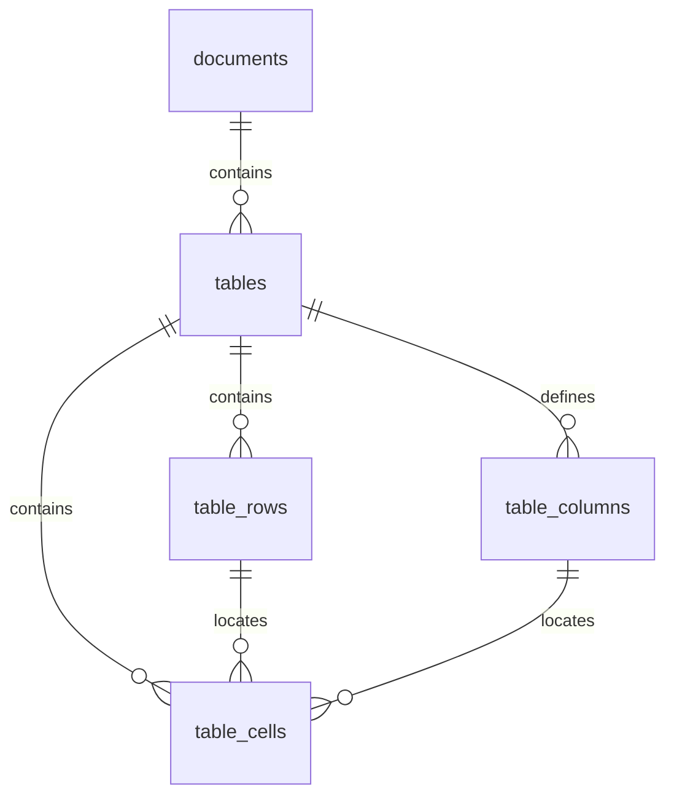

# Structured table ingestion

Cephalon stores PDF, CSV, and XLSX tables in an additive normalized SQLite
layer while retaining their text blocks in the existing dense and FTS indexes.
This makes table ingestion backward-compatible with text retrieval and gives
later table-aware stages stable rows, columns, cells, and provenance.

Migration `018_typed_tables` creates `tables`, `table_columns`, `table_rows`,
and `table_cells`. Table records retain document/source identity, sheet or page
location, table bounds and dimensions, parser version, structural provenance,
and warnings. Columns retain raw and normalized headers plus conservative type
and unit inference. Rows retain stable order and sheet/page identity. Cells
retain stable references, raw and normalized values, type, unit, coordinates,
formula metadata, and warnings. Foreign keys cascade from documents and table
replacement occurs in the same SQLite transaction as chunks and assets.

## Parsing contract

- Raw cell text is retained. Decimal normalization uses `Decimal`; ambiguous
  locale forms such as `1,23` remain text.
- Signs, scientific notation, percentages, units, missing values, booleans,
  dates, and datetimes are recognized conservatively. Units are stored apart
  from the normalized number.
- `normalized_value` stores percentages in percentage points. For example, an
  XLSX scalar `0.125` formatted as `0.0%` retains raw value `0.125` and
  normalizes to `12.5` with unit `%`, matching textual `12.5%` input.
- IDs derive from document identity, structural location, and unchanged table
  content, so identical reingestion produces identical IDs.
- PDF boxes remain in the original page coordinate system. Line tables use
  parser cell boxes when available; borderless tables derive boxes from words.
- CSV validates decoding across the complete stream, records the selected
  encoding and delimiter, and preserves blank cells and row order. Row, column,
  cell-count, and cell-length limits emit explicit warnings.
- XLSX treats each non-empty worksheet as one deterministic table. It preserves
  sheet/cell references, merged ranges, number formats, and formula text.
  A cached formula value is retained as `effective_value` when the workbook
  supplies one. Cephalon does not ask openpyxl to recalculate formulas and does
  not invent a result when a cache is unavailable.

## Reindex and rollback

This parser/schema change requires explicit reindexing for existing documents.
Use the application's reindex action after upgrading, and verify index health
before relying on table routes. Migration is additive and does not rewrite old
chunks during startup.

`CEPHALON_TYPED_TABLES=1` is the default. Set it to `0` before starting the
backend to stop writing or routing through the typed layer. Existing table rows
may remain dormant; ordinary table text continues through dense and FTS
retrieval. Re-enable the flag and reindex to refresh typed rows. A failed
reindex rolls back SQLite rows and restores the previous vector set.

Operational limits are defined in `services/table_models.py`: 100,000 rows,
256 columns, 2,000,000 cells per table, and 32,768 characters per cell.
Generated benchmark databases and reports remain under `C:\tmp`.
