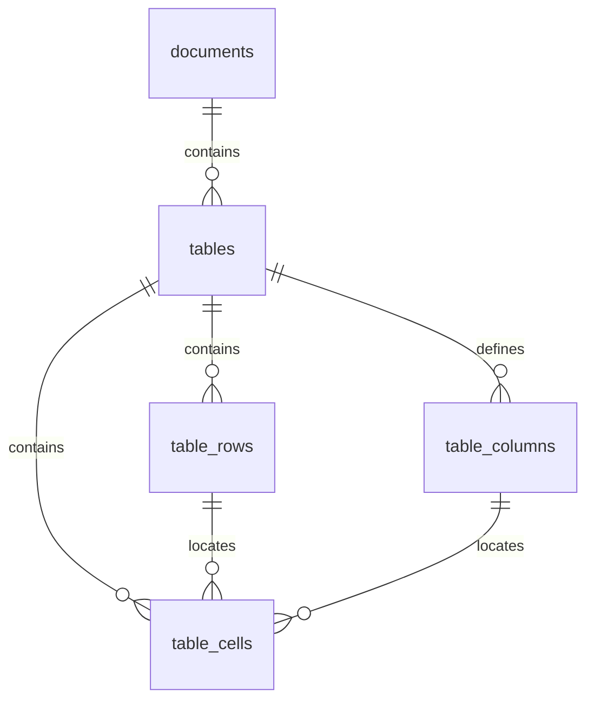

# Structured table ingestion

Cephalon stores PDF, CSV, and XLSX tables in an additive normalized SQLite
layer while retaining their text blocks in the existing dense and FTS indexes.
This makes table ingestion backward-compatible with text retrieval and gives
later table-aware stages stable rows, columns, cells, and provenance.



Migration `018_typed_tables` creates `tables`, `table_columns`, `table_rows`,
and `table_cells`. Table records retain document/source identity, sheet or page
location, table bounds and dimensions, parser version, structural provenance,
and warnings. Columns retain raw and normalized headers plus conservative type
and unit inference. Rows retain stable order and sheet/page identity. Cells
retain stable references, raw and normalized values, type, unit, coordinates,
formula metadata, and warnings. Foreign keys cascade from documents and table
replacement occurs in the same SQLite transaction as chunks and assets.

## Parsing contract

- Raw cell text is retained. Decimal normalization uses `Decimal`; ambiguous
  locale forms such as `1,23` remain text.
- Signs, scientific notation, percentages, units, missing values, booleans,
  dates, and datetimes are recognized conservatively. Units are stored apart
  from the normalized number.
- IDs derive from document identity, structural location, and unchanged table
  content, so identical reingestion produces identical IDs.
- PDF boxes remain in the original page coordinate system. Line tables use
  parser cell boxes when available; borderless tables derive boxes from words.
- CSV records detected encoding and delimiter and preserves blank cells and row
  order. Row, column, cell-count, and cell-length limits emit explicit warnings.
- XLSX treats each non-empty worksheet as one deterministic table. It preserves
  sheet/cell references, merged ranges, number formats, and formula text.
  Cephalon does not ask openpyxl to recalculate formulas and does not invent a
  cached value when one is unavailable.

## Reindex and rollback

This parser/schema change requires explicit reindexing for existing documents.
Use the application's reindex action after upgrading, and verify index health
before relying on table routes. Migration is additive and does not rewrite old
chunks during startup.

`CEPHALON_TYPED_TABLES=1` is the default. Set it to `0` before starting the
backend to stop writing or routing through the typed layer. Existing table rows
may remain dormant; ordinary table text continues through dense and FTS
retrieval. Re-enable the flag and reindex to refresh typed rows. A failed
reindex rolls back SQLite rows and restores the previous vector set.

Operational limits are defined in `services/table_models.py`: 100,000 rows,
256 columns, 2,000,000 cells per table, and 32,768 characters per cell.
Generated benchmark databases and reports remain under `C:\tmp`.

## Deterministic execution

`services/table_planning.py` exposes `TablePlan`, `TableFilter`, and
`plan_table_query()`. Plans contain only whitelisted operations, stable table
IDs, numeric column indexes, typed filters, units, cell operands, direction,
and a result limit. `TablePlan.from_payload()` rejects unknown fields, so a
future constrained model planner cannot smuggle SQL or identifiers into the
executor.

`services/table_retrieval.py` validates the plan against stored columns and
executes application-owned parameterized reads. Supported operations are
lookup, filter, sort, group, min, max, sum, mean, count, compare, difference,
and percentage. Arithmetic uses `Decimal`. Generic expressed-unit lookups with
several matches return the complete bounded candidate set with citations and
zero generation calls; they never let the generation model guess one value.
Mixed units, missing columns,
ambiguous tables/filters, missing operands, division by zero, and unrecognized
questions fall back to ordinary hybrid retrieval.

Hard bounds are 16 tables per plan, 64 candidate tables, 5,000 cells examined
per candidate during planning, 50,000 cells scanned during execution, 24 result
rows or requested-unit candidates, 8,000 context characters, 250 ms for
planning and 250 ms for SQLite execution. A SQLite progress handler enforces
the execution deadline and is always removed afterward.

Lookup evidence is additive: structured candidates cannot suppress nearby
prose when several values share a unit. Selected table results are emitted as
`SourceChunk`-compatible sources with `source_kind=table`; B2 stores table ID,
cell references, operation, and validated plan under `provenance`. The normal
`[[src:S1]]` marker remains unchanged. Migration `019_table_execution_trace`
persists the route decision and bounds in `retrieval_queries`.

```json
{
  "route": "typed_table",
  "status": "executed",
  "validated_plan": {"operation": "mean", "table_ids": ["tbl-..."], "value_column": 2},
  "result_cell_refs": ["Results!C2", "Results!C3"],
  "model_calls": 0,
  "bounds": {"max_results": 12, "timeout_ms": 250}
}
```

Set `CEPHALON_TABLE_EXECUTION=0` to disable planning/execution without
reindexing. Typed rows and text retrieval remain available. No generated SQL,
formula evaluation, recursive table gap loop, or cross-document aggregation is
permitted.

The frozen 18-answer `tables-v1` run on 2026-08-12 used the same B1 index,
Ling 3.0 Tiny Q6_K, and Jina v3.5 Q8_0. Numeric accuracy increased from
5.56% to 94.44% (94.12% relative error reduction), with no runtime failures.
Mean answer latency fell from 21.47 s to 5.95 s because bounded expressed-unit
answers use zero chat-completion calls. The one remaining miss is a flattened
scientific-axis label whose indexed text does not contain the frozen expected
number; the executor does not fabricate it.
